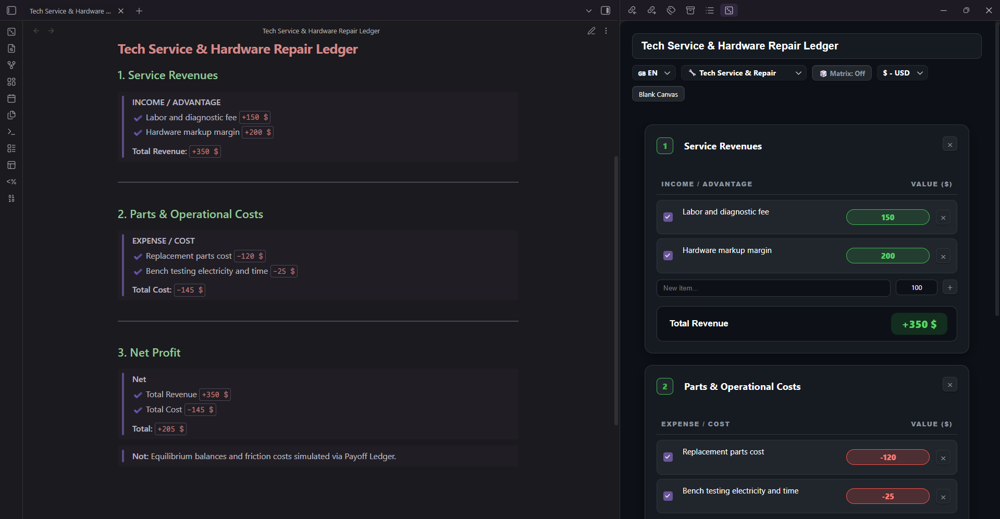
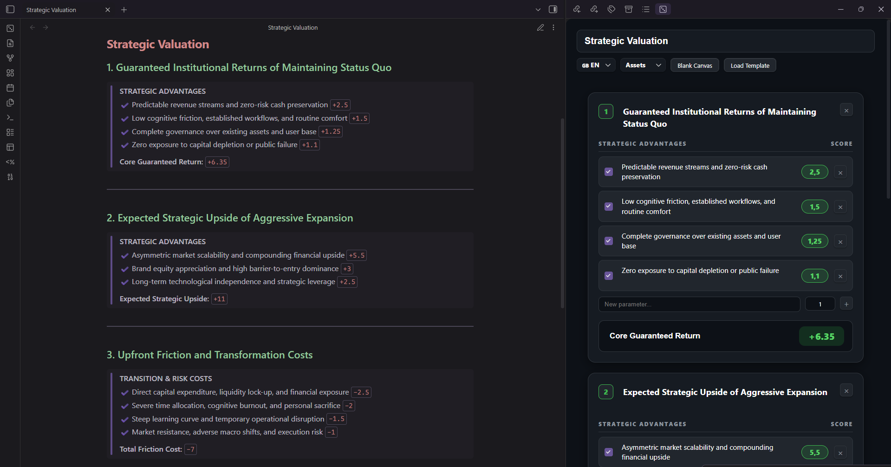

# Payoff Ledger ⚖️🎲

[](https://obsidian.md)
[](LICENSE)
[](https://github.com/kurnazsemih71/payoff-ledger-obsidian/pulls)

**Payoff Ledger** is a highly flexible, quantitative decision-making and financial ledger plugin for Obsidian. It bridges the gap between **Game Theory payoff matrices** and **multi-currency accounting**, allowing you to calculate complex trade-offs, balance budgets, and simulate friction costs directly inside your vault.

Because every user's needs are different, **Payoff Ledger imposes zero rigid structures**. Whether you are an IT professional calculating hardware markup, a gamer calculating MMORPG slot efficiency, or a strategist evaluating market expansion, the UI is entirely adaptable to your context.

---

## 📸 Visual Workflow & Fully Editable Interface

Configure your ledger dimensions, toggle parameters, and let the plugin calculate net outcomes. Compile non-destructive, theme-native Markdown notes directly into your vault.




---

## ✨ Key Features & New Updates

- **Fully Editable UI Labels:** Click and edit *any* column header. Change "EXPENSE / COST" to "Net Profit", "Friction", or "Sarfiyat", and change "VALUE" to "Score" or "Adet". The ledger adapts to your vocabulary.
- **Dynamic Color-Coded Totals:** Net total badges automatically react to your inputs—turning bright green for positive net gains and red for negative costs/losses.
- **Dynamic Reactive Payoff Matrix:** Active positive items sum to green payoffs and negative friction items sum to red costs in the interactive $N \times M$ matrix.
- **Optional Matrix Display (Toggle):** Hide the game theory matrix via the top toolbar (`🎲 Matrix: Off`) to use the plugin as a pure, clean financial ledger.
- **Auto-Expanding Numeric Inputs:** Pill badges expand dynamically to accommodate large numbers, featuring localized thousands separators (e.g., `2,500,000.50 $` or `2.500.000,50 ₺`).
- **Editable Matrix Labels & Legends:** Direct inline editing for matrix explanatory subtitles and quadrant legends.
- **Multi-Currency & i18n Support:** Instant toggle between English (EN) and Turkish (TR), with full decimal support for `₺`, `$`, `€`, `£`, or raw points.

---

## 🎯 Practical Presets Library

Load pre-configured templates with a single click:

| Preset | Operational Domain | Modeled Balance |
| :--- | :--- | :--- |
| **🎲 Strategic Decision Matrix** | Strategy & Business | Status Quo Floor vs. Market Expansion Upside |
| **🔧 Tech Service & Repair** | Hardware & IT Services | Labor & Part Revenue vs. Consumables & Risk |
| **⚔️ Game Farm & Efficiency** | MMORPG / Gaming Economy | Loot & Drop Value vs. Potion, Automation & Time |
| **🚗 Fuel & Mileage Tracking** | Travel & Logistics | Transport Utility vs. Fuel, Tolls & Maintenance |
| **💻 Hardware Purchase Filter** | Capital & Equipment | Workflow Acceleration vs. Cash Flow & Debt Exposure |

---

## 🚀 Installation

### Manual Installation
1. Locate your Obsidian vault directory.
2. Navigate to:
   ```bash
   <YourVault>/.obsidian/plugins/payoff-ledger/
   ```
3. Copy `manifest.json`, `main.js`, and `styles.css` into this directory.
4. In Obsidian, open **Settings -> Community Plugins**, click **Reload**, and toggle **Payoff Ledger** on.
5. Click the **Dice** icon in the ribbon or use the command palette to launch the studio.

---

## 📄 Clean Markdown Export

When saved, Payoff Ledger generates a clean, readable Markdown report with zero formatting artifacts:

```markdown
### 3. Net Profit
> **Net**
> ✔ Total Revenue `+350 $`
> ✔ Total Cost `-145 $`
> 
> **Total:** `+205 $`
```

---

## 🤝 Contributing & Planned Enhancements

Payoff Ledger is open-source and ready for modular expansion. Future roadmap areas include:

- [ ] **Automated Nash Equilibrium Solver:** Mathematical detection of Pure/Mixed Strategy Nash Equilibria.
- [ ] **TypeScript & Build Pipeline:** Migration of `main.js` to modular TypeScript (`src/`) with `esbuild`.
- [ ] **Interactive Codeblock Parser:** Live score adjustments directly within Markdown Reading View.
- [ ] **Dataview / Canvas Integration:** Queryable metadata outputs and visual Canvas node bridges.

Feel free to open an **[Issue](https://github.com/kurnazsemih71/payoff-ledger-obsidian/issues)** for feature requests or bug reports!

---

## 📝 License

Distributed under the [MIT License](LICENSE). Maintained by the open-source community. Designed for strategic thinkers, vault architects, and operational managers.